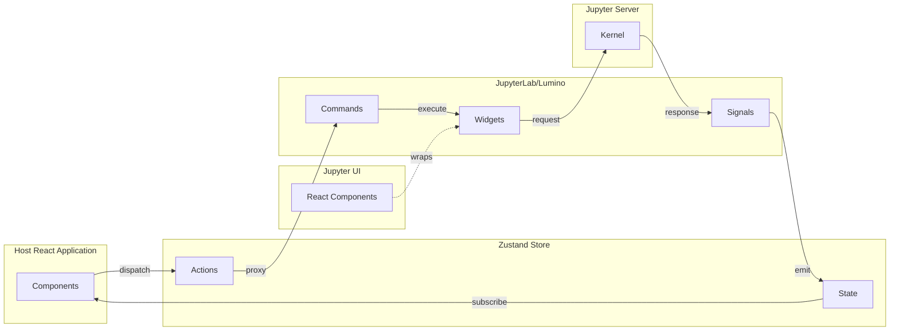

import { StorybookView } from '@theme/StorybookView';

import ModalImage from 'react-modal-image';

# 🪐 ⚛️ About Jupyter UI

Jupyter(Lab) Notebook is an IDE that allows Data Scientists to analyse datasets. However, it is not easy to create a custom user interface integrated in an existing application. Jupyter UI, [an open-source library](https://github.com/datalayer/jupyter-ui), fills that gap and provides components that a developer can easily integrate in any React.js application.

Jupyter UI is a set of [React.js](https://reactjs.org) components that allow a Web application developer to build [Data Products and Data Platforms](https://datalayer.tech/docs/glossary) compatible with the [Jupyter](https://jupyter.org) ecosystem. The user interface delivers executable notebooks, cells, terminals, file browsers, and rich text editors with code execution, allowing the developer to manage a full integrated React tree instead of relying on iframes to display the Jupyter Notebooks.

<StorybookView story="components-notebook--default" />

## Packages

The Jupyter UI repository provides three main packages:

| Package                        | npm                                                                                                                         | Description                                                        |
| ------------------------------ | --------------------------------------------------------------------------------------------------------------------------- | ------------------------------------------------------------------ |
| **@datalayer/jupyter-react**   |      | Core React components for Jupyter (Notebook, Cell, Terminal, etc.) |
| **@datalayer/jupyter-lexical** |  | Lexical editor with executable Jupyter cells                       |
| **@datalayer/jupyter-embed**   |      | Easy embedding via HTML data attributes                            |

We ensure React.js as a first-class citizen in the Jupyter ecosystem:

- [Components](/components): JupyterLab visuals as React.js components
- [Lexical](/integrations/lexical): Rich text editor with executable code
- [Embed](/integrations/embed): Drop-in embedding for any website
- [Integrations](/integrations): Integrate Jupyter in Docusaurus, Next.js...
- [Themes](/themes): Themes for your data analysis

## Why?

:::info

Although a developer can embed a React.js component into JupyterLab, the reverse is not possible.

**You can NOT embed JupyterLab into a React.js application - This is that issue that Jupyter UI solves.**.

:::

JupyterLab is not usable by Web Developers. Jupyter(Lab) user interfaces are built on top of [Lumino](https://github.com/jupyterlab/lumino) widget toolkit, which is an [imperative way](https://en.wikipedia.org/wiki/Imperative_programming) to build user interface and **can not** be consumed by industry standard declarative frameworks like React.js. As a user interface developer, if you want to create a custom [Data Products and Data Platforms](https://datalayer.tech/docs/glossary) on top of Jupyter, you have to stick to Lumino and carry-on the full notebook interface not tailored to your specific needs. This is not what you want. You just want to expose what you need, you want to develop with your favorite [declarative](https://en.wikipedia.org/wiki/Declarative_programming) toolkit (like React.js) and you also want to integrate on a per-component basis the Jupyter functionality in your application.

1. Lumino allows to wrap React components and expose them as Lumino Widgets.
2. React.js **can not** use Lumino Widgets.

Jupyter UI provides the foundations to build a modern and flexible [Data Products and Data Platforms](https://datalayer.tech/docs/glossary) user interface. Underneath, it gathers the minimum set of [Lumino](https://github.com/jupyterlab/lumino) and [JupyterLab](https://github.com/jupyterlab/jupyterlab) technologies. We wrap Lumino Widget in a React.js component and expose Zustands actions that proxy Lumino Commands. We bind Zustands Epics to Lumino Signals. Those bindings convert Lumino Signals to Observable to run the needed actions in the [Observable Epics](https://redux-observable.js.org/docs/basics/Epics.html).

- Services to connect to kernels.
- Extension injection system.
- Lumino signals and messages integrated with Zustand.
- Lumino commands.

To solve the above issues, Jupyter UI ships components to easily create a React.js [Data Products and Data Platforms](https://datalayer.tech/docs/glossary) compatible with the Jupyter ecosystem. Those components can be used in any React.js application, and also in static websites like Docusaurus, Next.js or Remix. They wrap underneath the JupyterLab code and allow developing React.js applications with code execution capability. State management is based on Zustand, and Mobx is to be added.

The Jupyter UI components expose JupyterLab visuals as React.js components and offers a bi-directional communication between React.js/Zustand and JupyterLab/Lumino.

JupyterLab/Lumino is heavily built on top of factories. Jupyter UI uses those to create the ad-hoc widgets. IPyWidgets and Comm are supported. JupyterLite and PyScript support is on the roadmap. Autocompletion is also available.

You can find more context reading this [abstract](https://fosdem.org/2022/schedule/event/lt_jupyter) of the talk given at [FOSDEM 2022](https://fosdem.org/2022) ([video recording](http://bofh.nikhef.nl/events/FOSDEM/2022/L.lightningtalks/lt_jupyter.webm)).

## Examples

The below image shows a gallery of the available React.js components ready to be used in you custom application. These open source components are used to build the [Datalayer SaaS, a collaborative platform for data analysis](https://datalayer.ai).

<ModalImage
  small="https://jupyter-examples.datalayer.tech/jupyter-react-gallery.gif"
  large="https://jupyter-examples.datalayer.tech/jupyter-react-gallery.gif"
  alt="Jupyter UI Gallery"
/>

## Listed

We love when people talk about us.

- [Reactjs Example.com](https://reactjsexample.com/react-components-compatible-with-the-jupyter-ecosystem-to-create-your-own-custom-data-product).
- [How We Made Jupyter Notebooks Load 10 Times Faster](https://www.singlestore.com/blog/how-we-made-notebooks-load-10-times-faster).
