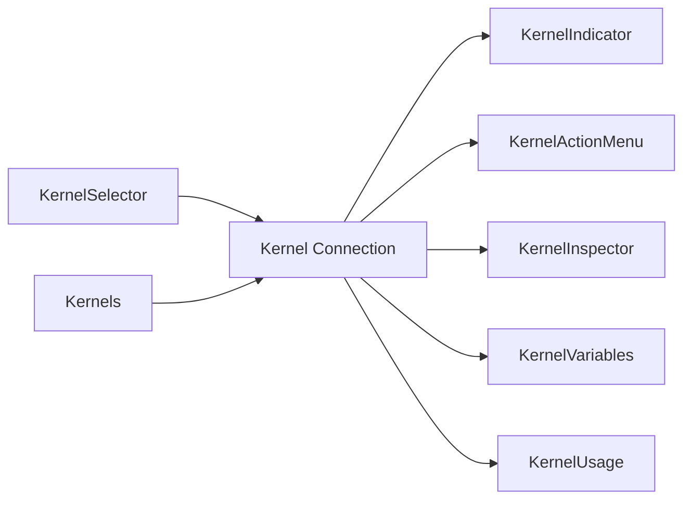

# 🪐 Kernel Components

The Kernel components provide a comprehensive set of React components for interacting with Jupyter kernels. These components allow you to monitor kernel status, select and manage kernels, inspect variables, view resource usage, and control the kernel lifecycle.

## Overview



## KernelIndicator

The `KernelIndicator` component displays the current state of a kernel connection using color-coded icons. It provides visual feedback about the kernel's execution state.

### Kernel States

| State                      | Icon Color | Description                 |
| -------------------------- | ---------- | --------------------------- |
| `connecting`               | Plus icon  | Attempting to connect       |
| `connected-unknown`        | Light gray | Connected but state unknown |
| `connected-starting`       | Yellow     | Kernel is starting          |
| `connected-idle`           | Green      | Kernel is idle and ready    |
| `connected-busy`           | Orange     | Kernel is executing code    |
| `connected-terminating`    | White      | Kernel is shutting down     |
| `connected-restarting`     | Purple     | Kernel is restarting        |
| `connected-autorestarting` | Hollow red | Kernel auto-restarting      |
| `connected-dead`           | Red        | Kernel has died             |
| `disconnecting`            | Brown      | Disconnecting from kernel   |

### Usage

```tsx
import { KernelIndicator } from '@datalayer/jupyter-react';

<KernelIndicator kernel={kernelConnection} label="Python 3" />;
```

### Props

| Prop     | Type                        | Description                      |
| -------- | --------------------------- | -------------------------------- |
| `kernel` | `IKernelConnection \| null` | The kernel connection to monitor |
| `label`  | `string`                    | Optional label to display        |
| `env`    | `Environment`               | Optional environment information |

## KernelSelector

The `KernelSelector` component provides a dropdown menu for selecting either an existing running kernel or launching a new kernel from available kernel specifications.

### Usage

```tsx
import { KernelSelector } from '@datalayer/jupyter-react';

<KernelSelector
  selectKernel={kernelModel => {
    console.log('Selected kernel:', kernelModel.id);
  }}
  selectKernelSpec={kernelSpec => {
    console.log('Launching kernel:', kernelSpec.name);
  }}
/>;
```

### Props

| Prop               | Type                                    | Description                                       |
| ------------------ | --------------------------------------- | ------------------------------------------------- |
| `selectKernel`     | `(kernelModel: IModel) => void`         | Callback when a running kernel is selected        |
| `selectKernelSpec` | `(kernelSpecModel: ISpecModel) => void` | Callback when a kernel spec is selected to launch |

## KernelActionMenu

The `KernelActionMenu` component provides a kebab menu with common kernel actions:

- **Interrupt kernel** - Stop the currently running execution
- **Restart kernel** - Restart the kernel
- **Clear outputs** - Clear all outputs (when outputAdapter is provided)

### Usage

```tsx
import { KernelActionMenu } from '@datalayer/jupyter-react';

<KernelActionMenu kernel={kernel} outputAdapter={outputAdapter} />;
```

### Props

| Prop            | Type            | Description                                  |
| --------------- | --------------- | -------------------------------------------- |
| `kernel`        | `Kernel`        | The kernel instance to control               |
| `outputAdapter` | `OutputAdapter` | Optional output adapter for clearing outputs |

## KernelInspector

The `KernelInspector` component provides a spy view into kernel message traffic. It displays all messages sent to and received from the kernel, useful for debugging and understanding kernel communication.

### Usage

```tsx
import { KernelInspector } from '@datalayer/jupyter-react';

<KernelInspector kernel={kernel} />;
```

### Props

| Prop     | Type     | Description           |
| -------- | -------- | --------------------- |
| `kernel` | `Kernel` | The kernel to inspect |

## KernelVariables

The `KernelVariables` component displays a panel showing all variables currently defined in the kernel's namespace. It provides a variable inspector similar to JupyterLab's variable inspector extension.

### Usage

```tsx
import { KernelVariables } from '@datalayer/jupyter-react';

<KernelVariables kernel={kernel} />;
```

### Props

| Prop     | Type     | Description                           |
| -------- | -------- | ------------------------------------- |
| `kernel` | `Kernel` | The kernel whose variables to display |

## KernelUsage

The `KernelUsage` component displays real-time resource usage statistics for a kernel, including:

- CPU usage (kernel and host)
- Memory usage with sparkline visualization
- Number of CPU cores

Uses `psutil` to gather metrics from the kernel process.

### Usage

```tsx
import { KernelUsage } from '@datalayer/jupyter-react';

<KernelUsage kernel={kernel} />;
```

### Props

| Prop     | Type     | Description           |
| -------- | -------- | --------------------- |
| `kernel` | `Kernel` | The kernel to monitor |

## Kernels

The `Kernels` component displays a data table of all running kernels with the ability to manage them. It shows:

- Kernel name and ID
- Description (for custom kernel specs)
- Number of connections
- Execution state
- Actions (shutdown, open notebook example)

### Usage

```tsx
import { Kernels } from '@datalayer/jupyter-react';

<Kernels />;
```

## KernelDetective

The `KernelDetective` component provides a debugging view showing:

- Server connection settings
- List of running kernels with connection counts
- List of active sessions

Useful for debugging connection issues and understanding the kernel/session relationship.

### Usage

```tsx
import { KernelDetective } from '@datalayer/jupyter-react';

<KernelDetective serviceManager={serviceManager} />;
```

### Props

| Prop             | Type                      | Description                 |
| ---------------- | ------------------------- | --------------------------- |
| `serviceManager` | `ServiceManager.IManager` | The Jupyter service manager |

## KernelProgressBar

A simple animated progress bar component that can be used to indicate kernel activity.

### Usage

```tsx
import { KernelProgressBar } from '@datalayer/jupyter-react';

<KernelProgressBar />;
```

## KernelLauncher

_Component placeholder - not yet implemented._

## KernelLogs

_Component placeholder - not yet implemented._

## Complete Example

Here's an example combining multiple kernel components:

```tsx
import {
  JupyterReactTheme,
  Kernel,
  KernelIndicator,
  KernelSelector,
  KernelActionMenu,
  KernelVariables,
  KernelUsage,
  useJupyter,
} from '@datalayer/jupyter-react';

const KernelDashboard = () => {
  const { kernel } = useJupyter();

  return (
    <JupyterReactTheme>
      <div style={{ display: 'flex', alignItems: 'center', gap: '8px' }}>
        <KernelIndicator kernel={kernel?.connection} label="Status" />
        <KernelSelector
          selectKernel={model => console.log('Selected:', model)}
          selectKernelSpec={spec => console.log('Launching:', spec)}
        />
        <KernelActionMenu kernel={kernel} />
      </div>

      <h3>Variables</h3>
      <KernelVariables kernel={kernel} />

      <h3>Resource Usage</h3>
      <KernelUsage kernel={kernel} />
    </JupyterReactTheme>
  );
};
```

## See Also

- [Cell Component](../cell) - For executing code in a kernel
- [Notebook Component](../notebook) - Full notebook interface with kernel support
- [Console Component](../console) - Interactive console with kernel
