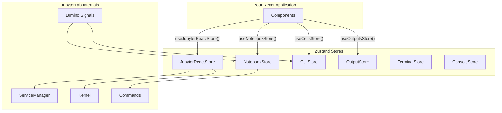

# Application State

Jupyter React uses [Zustand](https://github.com/pmndrs/zustand) for state management. This provides a lightweight, performant way to manage global state and enables bi-directional communication between your React application and JupyterLab/Lumino internals.

## Architecture Overview



## Main Store: JupyterReactStore

The central store that manages the Jupyter connection and global state.

### Accessing the Store

```tsx
import { useJupyterReactStore } from '@datalayer/jupyter-react';

function MyComponent() {
  // Get entire store
  const store = useJupyterReactStore();

  // Or select specific values (recommended for performance)
  const kernel = useJupyterReactStore(state => state.kernel);
  const serviceManager = useJupyterReactStore(state => state.serviceManager);
  const colormode = useJupyterReactStore(state => state.colormode);

  return <div>Kernel loaded: {kernel ? 'Yes' : 'No'}</div>;
}
```

### Store Properties

| Property            | Type                          | Description                               |
| ------------------- | ----------------------------- | ----------------------------------------- |
| `kernel`            | `Kernel \| undefined`         | The active Jupyter kernel                 |
| `kernelIsLoading`   | `boolean`                     | Whether a kernel is being initialized     |
| `serviceManager`    | `ServiceManager \| undefined` | JupyterLab service manager for API access |
| `jupyterConfig`     | `IJupyterConfig`              | Current Jupyter configuration             |
| `colormode`         | `'light' \| 'dark'`           | Current color mode                        |
| `version`           | `string`                      | Library version                           |
| `jupyterLabAdapter` | `JupyterLabAppAdapter`        | Adapter for JupyterLab app integration    |

### Store Actions

| Action                          | Description                  |
| ------------------------------- | ---------------------------- |
| `setColormode(colormode)`       | Change the color mode        |
| `setServiceManager(manager)`    | Set the service manager      |
| `setJupyterConfig(config)`      | Update Jupyter configuration |
| `setJupyterLabAdapter(adapter)` | Set the JupyterLab adapter   |

## Component-Specific Stores

Each major component has its own store for managing component-specific state.

### NotebookStore

Manages state for notebook instances.

```tsx
import { useNotebookStore } from '@datalayer/jupyter-react';

function NotebookController({ notebookId }: { notebookId: string }) {
  const notebookStore = useNotebookStore();

  // Get notebook adapter
  const adapter = notebookStore.selectNotebookAdapter(notebookId);

  // Execute operations
  const runAll = () => notebookStore.runAll(notebookId);
  const insertCell = () =>
    notebookStore.insertCell(notebookId, 'code', 0, 'print("Hello")');
  const deleteCell = () => notebookStore.deleteCell(notebookId, 0);

  // Read notebook state
  const cells = notebookStore.readAllCells(notebookId, 'brief');
  const kernelStatus = notebookStore.selectKernelStatus(notebookId);

  return (
    <div>
      <button onClick={runAll}>Run All</button>
      <button onClick={insertCell}>Insert Cell</button>
      <span>Kernel: {kernelStatus}</span>
    </div>
  );
}
```

#### Notebook Store Actions

| Action                                | Parameters                               | Description                   |
| ------------------------------------- | ---------------------------------------- | ----------------------------- |
| `run(id)`                             | notebook ID                              | Run the active cell           |
| `runAll(id)`                          | notebook ID                              | Run all cells                 |
| `insertCell(id, type, index, source)` | notebook ID, cell type, position, source | Insert a new cell             |
| `deleteCell(id, index)`               | notebook ID, cell index                  | Delete a cell                 |
| `updateCell(id, index, source)`       | notebook ID, cell index, new source      | Update cell content           |
| `readCell(id, index)`                 | notebook ID, cell index                  | Read cell content and outputs |
| `readAllCells(id, format)`            | notebook ID, 'brief' or 'detailed'       | Read all cells                |
| `clearAllOutputs(id)`                 | notebook ID                              | Clear all cell outputs        |
| `interrupt(id)`                       | notebook ID                              | Interrupt kernel execution    |
| `undo(id)`                            | notebook ID                              | Undo last action              |
| `redo(id)`                            | notebook ID                              | Redo last undone action       |
| `changeCellType(id, type)`            | notebook ID, cell type                   | Change active cell type       |
| `save(mutation)`                      | save mutation                            | Save notebook                 |

### CellStore

Manages state for individual cell components.

```tsx
import { useCellsStore } from '@datalayer/jupyter-react';

function CellController({ cellId }: { cellId: string }) {
  const cellStore = useCellsStore();

  // Get cell state
  const source = cellStore.getSource(cellId);
  const outputsCount = cellStore.getOutputsCount(cellId);
  const isExecuting = cellStore.isAnyCellExecuting;

  // Execute cell
  const execute = () => cellStore.execute(cellId);

  // Update source
  const updateSource = (newSource: string) => {
    cellStore.setSource(cellId, newSource);
  };

  return (
    <div>
      <button onClick={execute} disabled={isExecuting}>
        {isExecuting ? 'Running...' : 'Run'}
      </button>
      <span>Outputs: {outputsCount}</span>
    </div>
  );
}
```

#### Cell Store Properties & Actions

| Property/Action                | Description                           |
| ------------------------------ | ------------------------------------- |
| `getSource(id)`                | Get cell source code                  |
| `setSource(id, source)`        | Update cell source                    |
| `getOutputsCount(id)`          | Get number of outputs                 |
| `getAdapter(id)`               | Get cell adapter                      |
| `execute(id)`                  | Execute cell                          |
| `isKernelSessionAvailable(id)` | Check if kernel is ready              |
| `areAllKernelSessionsReady`    | Check if all cells have kernel access |
| `isAnyCellExecuting`           | Check if any cell is running          |

### OutputStore

Manages output state for Output components.

```tsx
import { useOutputsStore } from '@datalayer/jupyter-react';

function OutputController({ outputId }: { outputId: string }) {
  const outputStore = useOutputsStore();

  // Get output state
  const adapter = outputStore.getAdapter(outputId);
  const model = outputStore.getModel(outputId);

  // Execute code
  const executeCode = (code: string) => {
    adapter?.execute(code);
  };

  return <button onClick={() => executeCode('print("Hello")')}>Execute</button>;
}
```

### TerminalStore

Manages terminal instance state.

```tsx
import { useTerminalStore } from '@datalayer/jupyter-react';

function TerminalController() {
  const terminalStore = useTerminalStore();

  // Access terminal state and adapters
  const terminals = terminalStore.terminals;

  return <div>Active terminals: {terminals.size}</div>;
}
```

### ConsoleStore

Manages console (REPL) instance state.

```tsx
import { useConsoleStore } from '@datalayer/jupyter-react';

function ConsoleController() {
  const consoleStore = useConsoleStore();

  // Access console state
  const consoles = consoleStore.consoles;

  return <div>Active consoles: {consoles.size}</div>;
}
```

## Using with Props: useJupyterReactStoreFromProps

For components that need to initialize Jupyter from props:

```tsx
import { useJupyterReactStoreFromProps } from '@datalayer/jupyter-react';

function MyJupyterApp() {
  const store = useJupyterReactStoreFromProps({
    jupyterServerUrl: 'http://localhost:8888',
    jupyterServerToken: 'my-token',
    startDefaultKernel: true,
    defaultKernelName: 'python3',
    lite: false,
  });

  if (store.kernelIsLoading) {
    return <div>Loading kernel...</div>;
  }

  return <div>Kernel ready: {store.kernel?.connection?.status}</div>;
}
```

## Direct Store Access (Vanilla)

For non-React code or advanced use cases, access stores directly:

```typescript
import {
  jupyterReactStore,
  notebookStore,
  cellsStore,
} from '@datalayer/jupyter-react';

// Get current state
const state = jupyterReactStore.getState();
console.log('Current kernel:', state.kernel);

// Subscribe to changes
const unsubscribe = jupyterReactStore.subscribe(state => {
  console.log('Kernel changed:', state.kernel);
});

// Execute notebook actions directly
notebookStore.getState().runAll('my-notebook-id');
```

## Source Code

The state management implementation can be found in the [source code](https://github.com/datalayer/jupyter-ui/tree/main/packages/react/src/state).
